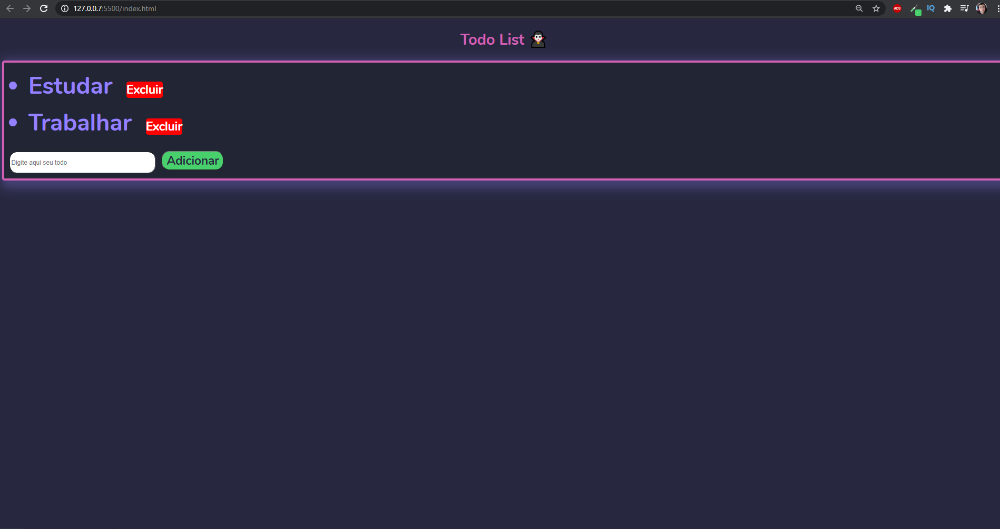
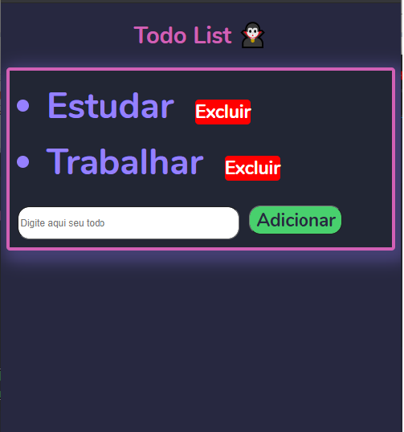

# Todo App theme  🧛‍♂️

## ℹ Sobre o Projeto 

 O projeto é uma lista de tarefas com o tema dracula 🧛‍♂️ 💜 

## 💻 Preview 
 

 

 
 

# 👷 Como rodar o projeto
<pre> 
# Clone Repository
$ git clone https://github.com/JorgeSantan/Todo_List.git </pre>

 

# 📦 Ligar o servidor  
<pre>
Você vai precisar  rodar com Live Server </pre>

## 👨‍💻 Visualizar WebSite
## Vá para http://localhost:5500/ para ver o website.

# 🧠 Tecnologias

- [HTML](https://developer.mozilla.org/pt-BR/docs/Web/HTML/HTML5)

- [CSS3](https://developer.mozilla.org/pt-BR/docs/Archive/CSS3)

- [JAVASCRIPT](https://developer.mozilla.org/pt-BR/docs/Web/JavaScript) 

<footer>Feito com 💗 <a href="#"> Jorge Santana 🚀 </footer>

